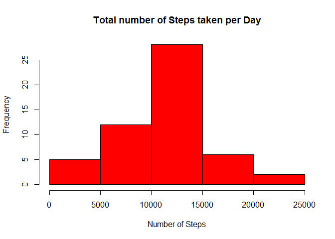
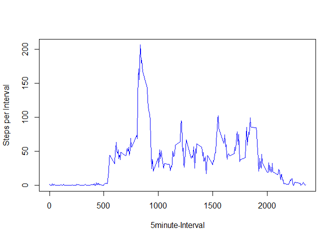
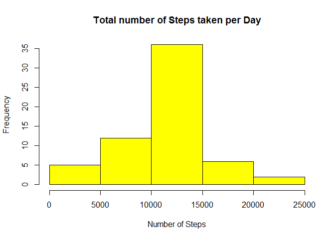
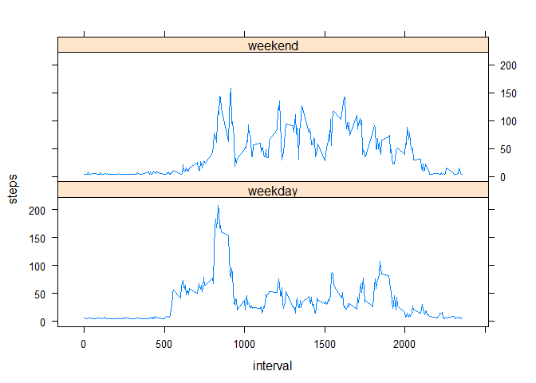

# Reproducible Research: Peer Assessment 1


## Loading and preprocessing the data

```r
setwd("C:/Users/vanem/Desktop/RepData_PeerAssessment1")
ActivityData <- read.csv("activity.csv")
```

## What is mean total number of steps taken per day?


```r
StepsPerDay <-  aggregate(steps~date, ActivityData, sum, na.rm=TRUE)
hist(StepsPerDay$steps, col="red", main="Total number of Steps taken per Day", xlab="Number of Steps")
```

<!-- -->

```r
 meanSteps <-round(mean(StepsPerDay$steps))
 medianSteps <-round(median(StepsPerDay$steps))
 print(c("The mean is",meanSteps))
```

```
## [1] "The mean is" "10766"
```

```r
 print(c("The median is",medianSteps))
```

```
## [1] "The median is" "10765"
```

## What is the average daily activity pattern?

```r
StepsPerInterval<- aggregate(steps~interval, ActivityData, mean, na.rm=TRUE)
plot(StepsPerInterval$interval,StepsPerInterval$steps, , col = "blue",  type="l", xlab="5minute-Interval", ylab="Steps per Interval")
```

<!-- -->

```r
maxInterval<-StepsPerInterval$interval[which.max(StepsPerInterval$steps)]
 print(c("The 5-minute Inteval which contains the maximun number of steps is ",maxInterval))
```

```
## [1] "The 5-minute Inteval which contains the maximun number of steps is "
## [2] "835"
```


## Imputing missing values

```r
NAsActivityData<-sum(is.na(ActivityData))
 print(c("The total number of missing values in the data set is ",NAsActivityData))
```

```
## [1] "The total number of missing values in the data set is "
## [2] "2304"
```

```r
 sum(is.na(ActivityData$steps))
```

```
## [1] 2304
```

```r
 sum(is.na(ActivityData$interval))
```

```
## [1] 0
```

```r
 sum(is.na(ActivityData$date))
```

```
## [1] 0
```
All the NAs are in the steps variable.
Then my strategy is to replace it with the daily mean. I replace the NAs in the newly created set

```r
NewActivityData <- ActivityData  
for (i in 1:nrow(NewActivityData)){
    if(is.na(ActivityData$steps[i]==TRUE)){
        NewActivityData$steps[i]<- (meanSteps/288)
    }
}
NAsNewActivityData<-sum(is.na(NewActivityData))
 print(c("The total number of missing values in the data set is ",NAsNewActivityData))
```

```
## [1] "The total number of missing values in the data set is "
## [2] "0"
```
##Create a histogram with the new data set

```r
NewStepsPerDay <-  aggregate(steps~date, NewActivityData, sum, na.rm=T)
hist(NewStepsPerDay$steps, col="yellow", main="Total number of Steps taken per Day", xlab="Number of Steps")
```

<!-- -->

```r
 NewMeanSteps <-round(mean(NewStepsPerDay$steps))
  NewMedianSteps <-round(median(NewStepsPerDay$steps))
  print(c("The mean is",NewMeanSteps))
```

```
## [1] "The mean is" "10766"
```

```r
  print(c("The median is",NewMedianSteps))
```

```
## [1] "The median is" "10766"
```

```r
  print(c("The diferrence in mean is", NewMeanSteps-meanSteps))
```

```
## [1] "The diferrence in mean is" "0"
```

```r
  print(c("The diferrence in median is", NewMedianSteps-medianSteps))
```

```
## [1] "The diferrence in median is" "1"
```

## Are there differences in activity patterns between weekdays and weekends?

```r
NewActivityData$day = ifelse(as.POSIXlt(as.Date(NewActivityData$date))$wday%%6 == 
                                     0, "weekend", "weekday")
NewActivityData$day = factor(NewActivityData$day, levels = c("weekday", "weekend"))
stepsInterval2 = aggregate(steps ~ interval + day, NewActivityData, mean)
library(lattice)
xyplot(steps ~ interval | day, data = stepsInterval2, layout=c(1,2),
    type = "l")
```

<!-- -->
